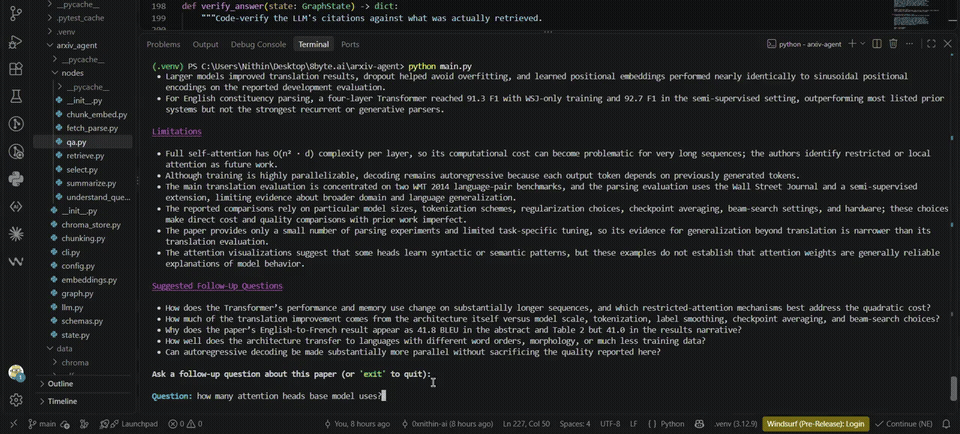
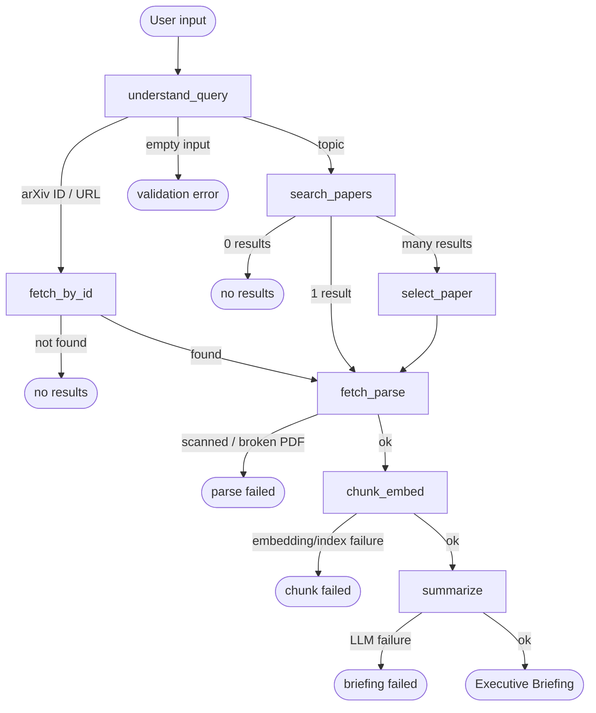
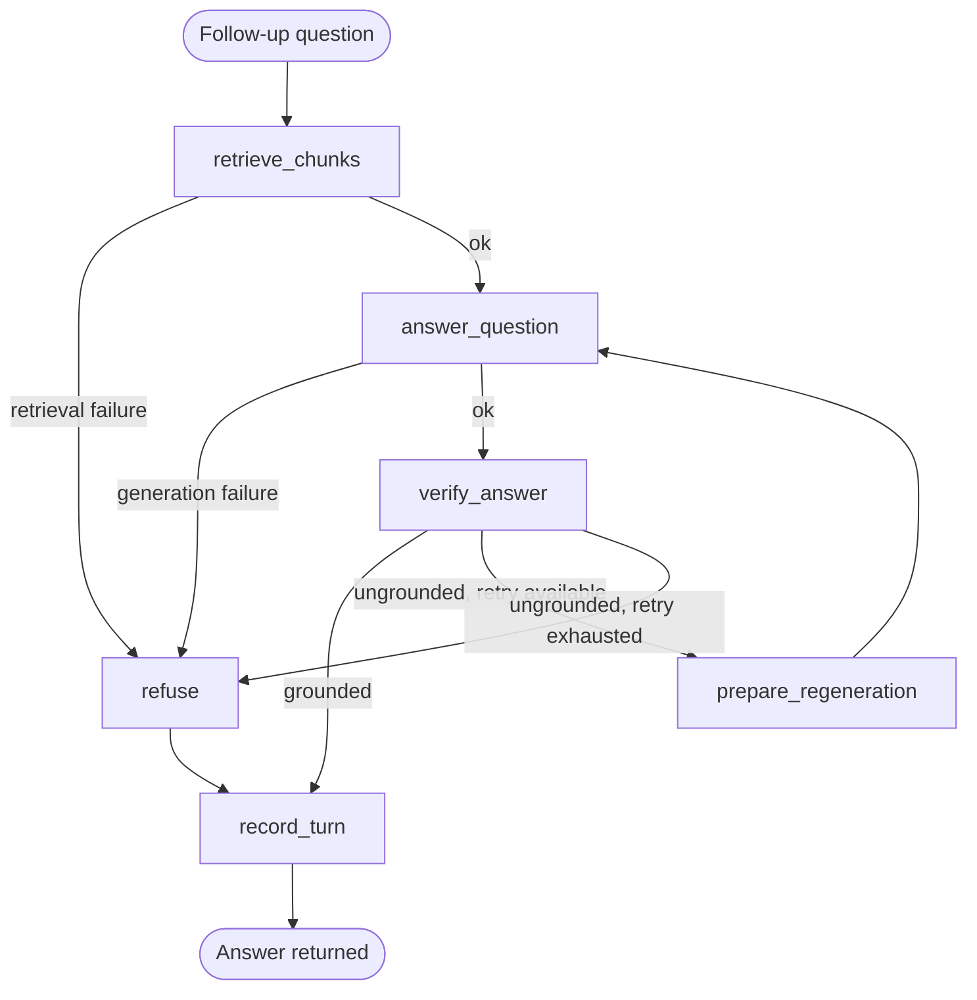

# Autonomous arXiv Paper Digest & QA Agent

Give it a research topic, an arXiv ID, or an arXiv URL. It finds the paper, downloads and parses the PDF, generates a structured executive briefing, and then answers follow-up questions about the paper — grounded in the paper's actual text, with an explicit refusal instead of a guess when the paper doesn't support an answer.

Built as an explicit [LangGraph](https://langchain-ai.github.io/langgraph/) state graph, not a single prompt chain. Runs entirely locally except for the (optional-to-be-paid) LLM call — no paid API key is required.

## Contents

- [Demo](#demo)
- [Architecture](#architecture)
- [Setup & Run](#setup--run)
- [Example Run](#example-run)
- [Design Decisions & Tradeoffs](#design-decisions--tradeoffs)
- [Testing](#testing)
- [Project Structure](#project-structure)

## Demo



40s clip — a grounded follow-up answer, then the explicit refusal path when asked something the paper doesn't cover. [Full 4-minute walkthrough (mp4)](docs/assets/demo.mp4).

## Architecture

The agent is two compiled `StateGraph`s, not one — see [why](#two-graphs-not-one) below.

### Ingestion graph: input → executive briefing



| Node | Does | On failure |
|---|---|---|
| `understand_query` | Regex-classifies input as an arXiv ID/URL or a free-text topic | Empty input → validation error |
| `fetch_by_id` | Direct arXiv lookup by ID (deterministic, no ranking needed) | Invalid ID → graceful message |
| `search_papers` | Topic search, top 5 by relevance | Zero matches → graceful message |
| `select_paper` | One LLM call picks the best of several candidates | Falls back to the top-ranked result on any failure |
| `fetch_parse` | Downloads the PDF (1 retry) and parses it to page-level Markdown via `pymupdf4llm` | Download/parse failure, or <500 chars extracted (scanned PDF) → graceful message, no OCR |
| `chunk_embed` | Paragraph-aware chunking (~450 tokens, ~15% overlap, section-aware) + local embedding + Chroma indexing | Embedding/indexing failure → graceful message |
| `summarize` | One structured-output call → the executive briefing | LLM failure → graceful message |

### QA graph: one grounded question-answer turn



| Node | Does |
|---|---|
| `retrieve_chunks` | Embeds the question, pulls top-4 chunks from this paper's Chroma collection |
| `answer_question` | Structured answer `{answer, citations, is_grounded}`; uses a stricter prompt if this is a retry |
| `verify_answer` | **Recomputes `is_grounded` in code** — not trusted from the LLM. Requires non-empty citations, every cited `chunk_id` to actually be in the retrieved set, and the model's own flag to agree |
| `prepare_regeneration` | Bumps the retry counter; loops back into `answer_question` with a stricter prompt |
| `refuse` | After one failed retry (or a retrieval/generation failure), returns "I couldn't find support for that in the paper." — never a guess |
| `record_turn` | Appends the completed turn (accepted or refused) to conversation history |

The code-verification step in `verify_answer` is the load-bearing part of this whole design: an LLM claiming "this is grounded" is not the same as it *being* grounded, so the citation is checked against what was actually retrieved this turn, in code, every time.

### State shape (`arxiv_agent/state.py::GraphState`)

A single `TypedDict` shared by both graphs:

```
raw_input, input_type                          # query understanding
candidate_papers, paper                         # arXiv retrieval / selection
parsed_pages, parse_failed                      # fetch & parse (page_number + text per page)
chunks, collection_name                         # chunk & embed (+ the Chroma collection reference)
briefing                                        # executive briefing
question, retrieved_chunks, answer,
  regeneration_count, conversation_history       # QA loop
error                                            # set by any node that fails; routes to a graceful end
```

`TypedDict`, not a Pydantic model: current LangGraph guidance treats `TypedDict` as the default state schema and calls a full-Pydantic state less performant. Pydantic is used instead where it earns its keep — the *outputs* nodes must produce correctly (`PaperMetadata`, `Chunk`, `ExecutiveBriefing`, `QAAnswer`), each validated on construction.

### Two graphs, not one

`thread_id` for checkpointing is supposed to be the paper's arXiv ID — but for a topic search, that ID isn't known until partway through ingestion. Splitting the graph resolves this cleanly: the **ingestion graph** is a one-shot flow that never needs to be resumed mid-way, so it runs without a meaningful thread_id at all. Only the **QA graph** is checkpointed, under `thread_id = paper.arxiv_id` — known by the time QA starts. The first QA call for a paper is seeded with the ingestion graph's in-memory final state (`state.seed_qa_session`); every later call, in the same process or a fresh one, needs only a small turn-reset (`state.create_qa_turn_input`) because the checkpointer already has the session data.

## Setup & Run

### Prerequisites

- Python 3.12+
- A free [Groq API key](https://console.groq.com/keys) — this alone is enough to run everything with **zero paid keys**
- Optionally, an [OpenAI API key](https://platform.openai.com/api-keys) for higher-quality answers (used as primary when present, with Groq as the automatic fallback)

### Install

```bash
cd arxiv-agent
python -m venv .venv

# Windows:
.venv\Scripts\activate
# macOS/Linux:
source .venv/bin/activate

pip install -r requirements.txt
```

### Configure

```bash
cp .env.example .env
# edit .env: set GROQ_API_KEY (free) and/or OPENAI_API_KEY (paid, optional)
```

If `OPENAI_API_KEY` is left blank, the agent skips OpenAI entirely and runs on Groq's free tier — the submission works out of the box with no paid key.

### Run

```bash
python main.py                              # interactive prompt
python main.py 2401.12345                   # or pass a topic / arXiv ID / URL directly
python main.py "recent work on KV-cache compression for LLMs"
```

Ask follow-up questions once the briefing prints; type `exit` (or `quit`/`q`, or Ctrl+C) to stop.

### Rate limits to know about

- **arXiv API**: capped at 1 request every 3 seconds (arXiv's own Terms of Use — "3 requests/second" is a common misreading and is backwards). Enforced automatically by the `arxiv` package's client; nothing to configure.
- **Groq free tier** (`openai/gpt-oss-120b`, the zero-paid-key path): 30 requests/min, 1,000 requests/day, 8,000 tokens/min, 200,000 tokens/day (checked directly against `console.groq.com/docs/rate-limits`). A briefing plus a handful of QA turns uses well under this.
- **OpenAI** (optional primary, paid): limits are account/tier-specific. The agent retries with exponential backoff on 429s, then falls back to Groq automatically — no action needed either way.

## Example Run

Real output from `python main.py 1706.03762` (Attention Is All You Need), lightly trimmed for length:

```
Autonomous arXiv Paper Digest & QA Agent
Enter a research topic, an arXiv ID (e.g. 2401.12345), or an arXiv URL.

Working...

                        Attention Is All You Need

Metadata
 • Title: Attention Is All You Need
 • Authors: Ashish Vaswani, Noam Shazeer, Niki Parmar, ...
 • arXiv ID: 1706.03762v7
 • Publish date: 2017-06-12
 • Link: https://arxiv.org/abs/1706.03762v7

Why This Paper Matters
This paper introduces the Transformer, an encoder-decoder architecture that
replaces recurrent and convolutional layers with attention mechanisms. On the
paper's translation benchmarks, it achieved substantially better or comparable
quality than prior systems while enabling much greater parallelism and lower
reported training cost. [...]

Method / Approach
 • Build an encoder-decoder model composed entirely of attention mechanisms,
   without recurrence or convolution.
 • Use scaled dot-product attention and eight parallel attention heads [...]
 [... 5 more bullets ...]

Limitations
 • Full self-attention has O(n^2 · d) per-layer complexity in sequence length [...]
 • The paper reports an inconsistency for English-to-French performance: the
   abstract and Table 2 give 41.8 BLEU, whereas Section 6.1 states 41.0 BLEU.
 [... 5 more bullets ...]

Ask a follow-up question about this paper (or 'exit' to quit):

Question: How many attention heads does the base model use?
The base model uses 8 attention heads.
Sources: 1706.03762v7#p5_0

Question: What was the price of Bitcoin when this paper was published?
I couldn't find support for that in the paper.

Question: Do the reported results generalize to low-resource languages, domains
different from WMT news text, and tasks beyond sequence transduction?
Only partially. The excerpts show generalization to a different task: English
constituency parsing, where the Transformer achieved strong results, including
92.7 F1 in the semi-supervised setting, and the authors explicitly evaluated
whether it could generalize beyond translation. However, the reported
translation results are for WMT 2014 English-German and English-French, so
these excerpts provide no evidence about low-resource languages or domains
different from WMT news text. Thus, they support task generalization, but not
broader generalization to low-resource languages or other domains.
Sources: 1706.03762v7#p9_3, 1706.03762v7#p10_0, 1706.03762v7#p8_3

Question: exit
Goodbye.
```

The second question is a deliberate off-paper test — it demonstrates the refusal path rather than a hallucinated answer, which matters more here than any grounded answer could. The third shows the agent isn't just binary grounded/refused: it separates what the retrieved excerpts *do* support (generalization to a different task) from what they *don't* (low-resource languages, non-WMT domains) instead of overclaiming either way. The `limitations` bullet quoting the paper's own BLEU-score inconsistency (41.8 in the abstract vs. 41.0 in Section 6.1's prose) wasn't prompted for specifically; it's the model actually cross-referencing the source text.

## Design Decisions & Tradeoffs

**Stateful graph over a monolithic prompt.** Each stage (query understanding, retrieval, selection, parse, chunk/embed, summarize, QA) is a separate node with its own state contract and failure mode, wired with conditional edges rather than buried in one large prompt — the 0/1/many-results and success/failure branches are explicit graph structure, not implicit control flow. This also makes each stage independently testable: 100+ mocked unit tests plus a real pipeline run for integration/adversarial coverage.

**Single retrieval, not hybrid BM25+dense+RRF+rerank.** An earlier research pass proposed hybrid lexical+dense retrieval, RRF fusion across query rewrites, and an LLM rerank over ~50 chunks — 3-6+ LLM calls per question against a rate-limited free tier, for a benefit that matters at corpus scale, not for QA over one paper that usually fits in a handful of chunks. The one piece worth keeping was **code-verified claim grounding + bounded regeneration** — what `verify_answer` and the regenerate-once-then-refuse loop actually implement.

**Other choices, each verified rather than assumed:**
- *OpenAI primary + Groq fallback, not Gemini* (the original free-tier plan) — Groq alone satisfies "no paid key required" whenever `OPENAI_API_KEY` is unset; model IDs are env vars since provider lineups move fast.
- *`bge-small-en-v1.5`, not `embeddinggemma-300m`* — the latter is HuggingFace-gated (`"gated": "manual"`, checked via the HF API), which breaks "clone and run." bge-small's real `max_seq_length` (512, checked by loading it) is also why chunks target ~450 tokens, not the 800-1000 a source document assumed without checking it against this model.
- *`SqliteSaver`, not `MemorySaver`, for the QA graph* — `MemorySaver` loses everything on process restart, which a QA turn in a separate CLI invocation would hit. Verified directly: ran ingestion, asked two questions, opened a brand-new checkpointer connection simulating a full restart, and asked a third — it still knew the paper, the briefing, and all three prior turns.

**Known limitations:** no OCR (a scanned/unparseable PDF refuses gracefully rather than being recovered); chunking is page-bounded, so a concept split across a page break can end up split across chunks too; old-style pre-2007 arXiv IDs fall through to (unhelpful) topic search; selection picks one paper per topic search, with no cross-paper synthesis; free-tier rate limits are a snapshot verified against primary sources during this build, not a permanent guarantee.

**With more time:** a cross-encoder reranker over retrieved chunks (the biggest plausible quality win, deferred as unnecessary at this scale); an OCR fallback instead of refusing on scanned PDFs; hybrid BM25+dense retrieval for notation-heavy papers, where embedding similarity alone can miss exact-term matches.

## Testing

```bash
pip install -r requirements.txt
pytest tests/                # ~104 unit tests, mocked, no network - always runs
pytest tests/ -v              # same, verbose
```

`test_integration.py` and `test_adversarial.py` hit the real pipeline (live arXiv, real embeddings, a real LLM) and skip automatically when no `OPENAI_API_KEY`/`GROQ_API_KEY` is configured — so the base suite needs zero paid keys, but running it with a key configured also proves the pipeline end to end, not just its pieces.

## Project Structure

```
arxiv-agent/
├── main.py                      # entry point: python main.py [input]
├── arxiv_agent/
│   ├── cli.py                   # interactive loop, briefing/answer rendering
│   ├── graph.py                 # the two compiled StateGraphs
│   ├── state.py                 # GraphState + session/turn-seeding helpers
│   ├── schemas.py                # Pydantic models: PaperMetadata, Chunk, ExecutiveBriefing, QAAnswer, ...
│   ├── llm.py                    # OpenAI-primary/Groq-fallback provider wiring
│   ├── embeddings.py             # local embedding model access
│   ├── chroma_store.py           # local vector store access
│   ├── chunking.py               # pure paragraph-aware chunking algorithm
│   ├── config.py                 # env/paths/constants
│   └── nodes/                    # one module per pipeline stage
│       ├── understand_query.py
│       ├── retrieve.py
│       ├── select.py
│       ├── fetch_parse.py
│       ├── chunk_embed.py
│       ├── summarize.py
│       └── qa.py
└── tests/                        # unit + integration + adversarial
```
